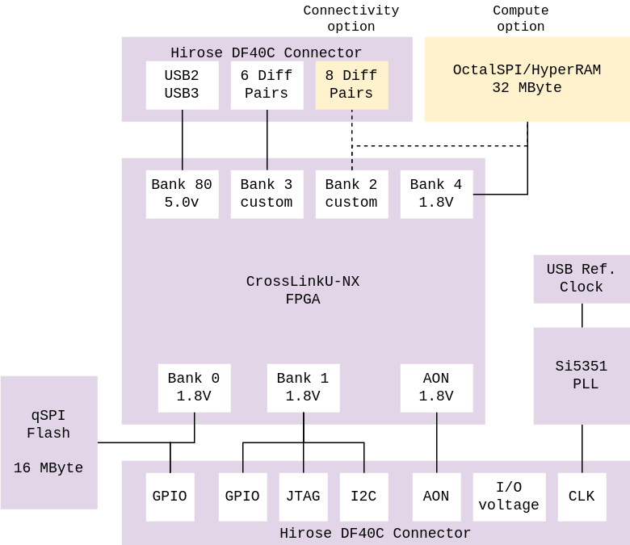

# tinyCLUNX33

[Order](https://tinyvision.ai/products/mipi-to-usb-connector-tinyclunx33-system-on-module) |
[Hardware](https://github.com/tinyvision-ai-inc/tinyCLUNX33/tree/main/Hardware) |
[Firmware](https://github.com/tinyvision-ai-inc/tinyclunx33_zephyr_example) |
[Schematics](boards.md) |
[Discord](https://discord.gg/yjVc6P3sCt)

25.4mm x 25.4mm x 4.5mm module, commercial temperature grade: 0°C to 85°C

Connector:
- 2x Hirose high density DF40C 60 pin connectors
- proven on thousands of SoM's in the field in high vibration environments
- Spare pins for future proofing

2 flavors:
- Connectivity: 14 diff pairs, no SSRAM
- Compute: 8 diff pairs, 32 MB [oSPI/HyperRAM](som_memory.md) @ <0.5GBps

I/O interfaces:
- 3x fully programmable clocks
- GPIO, I2C, field updates through FPGA or direct flash programming
- GPIO voltage is programmable

Firmware/RTL:
- uPython for control path on RISCv
- No code, graphical RTL generator with large # of IP blocks (under development)

Development boards:
- [devkit] for programming/debug
- extra adapter boards for various camera connectors and expansion
- reference designs such as a basis of a compact camera device

