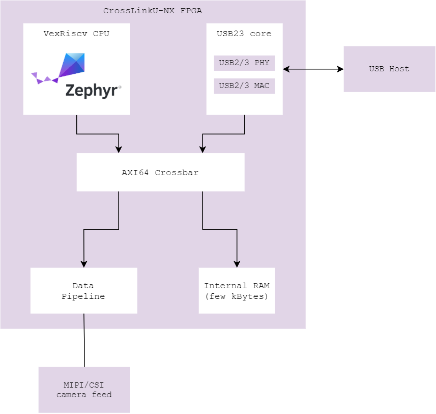

# RTL Reference Design

To facilitate the development of RTL projects, a Verilog implementation of a
working System-on-Chip (SoC) is provided.

The USB core requires fast access to a small local memory where TRB's can be stored and retrieved. Also, any USB transactions such as enumeration, CDC and other such low bandwidth tasks can use as a local scratch space where endpoint data is located.
For any higher bandwidth transfer, a full AXI64 slave is utilized that allows for fast transfer that can support the high bandwidth required to keep the USB pipe running without being throttled.

This core design is quite compact and consumes <1K LUT and a few block RAM's depending on the amount selected.

## Future Development
A new SoC is based on [Briey](https://github.com/SpinalHDL/VexRiscv#briey-soc) integrates a minimum viable system able to run USB using SpinalHDL. THis can be extended and modified to suit the users requirements for compute and connectivity.

A Radiant installation is only required for rebuilding the RTL.,
provided as
[binary releases](https://github.com/tinyvision-ai-inc/tinyclunx33/releases).

A SpinalHDL installation is only required for rebuilding the Briey SoC,
provided as
[Verilog artefacts](#TODO).

TODO: remove \subpage fpga_top

## External interface

The external interface for moving large amounts of data is a standard AXI64 slave. Specific configuration and addresses for AXI access are controlled by the corresponding USB endpoint configuration in the Zephyr driver.

## Internal fast AXI bus

The hard USB23 core AXI Master interface, issuing DMA requests to the memory:
- \subpage TODO

The Crosslink-NX Large RAM (LRAM) blocks of 64 kBytes each:
- \subpage TODO

A [VexRiscv](https://github.com/SpinalHDL/VexRiscv#area-usage-and-maximal-frequency)
CPU implementing the RISC-V RV32I specification:
- \subpage TODO

The external Octal SPI or HyperRAM chip.
- \subpage TODO

## Internal lower-speed peripheral bus

The hard USB23 core LMMI interface, used for controlling the core.

An QSPI, DDR, memory-mapped flash controller:
- \subpage TODO

An I2C controller used to program the [external Si5351 PLL](som_clocks.md),
MIPI configuration, and Type-C port manager if present:
- \subpage TODO

An UART for debug logs and bringup of software on the CPU:
- \subpage TODO
