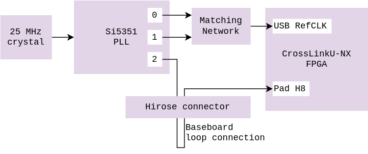

# SoM Clocks

The FPGA features two internal oscillators and an internal PLL to further
synthesize a clock signal out of the available sources.

An external Si5351A PLL is responsible for generating the differential USB3
reference clock, and has one remaining clock signals free to use.
Clocks are synthesized out of a 25 MHz Crystal Oscillator on the SoM.

The Si5351 PLL can be configured over I2C.
Skyworks provides a generator tool to build the table of I2C registers address
and value for a given clock setup.

| Clock                          | Frequency  | Location                 |
|--------------------------------|------------|--------------------------|
| PLL input crystal oscillator   | 25 MHz     | Si5351 input XA, XB      |
| USB REFCLK differential clock  | 60 MHz     | Si5351 output CLK0, CLK1 |
| PLL Extra output clock         | Selectable | Si5351 output CLK2       |
| PLL External input clock       | Selectable | SoM input pin            |
| FPGA high frequency oscillator | 450 MHz    | FPGA fabric              |
| FPGA low power oscillator      | 128 kHz    | FPGA fabric              |
| FPGA GPLL                      | Selectable | FPGA fabric              |
| MIPI clock                     | Selectable | RTL on the FPGA          |

## Hardware integration

The USB differential clock generation is already integrated internally
in the SoM.

The extra free output clock may be looped back to the external input clock pin,
so that the PLL provides a clock with an arbitrary frequency directly to the FPGA.

It is also possible to use the free output clock pin elsewhere on the project.

It is also possible to provide an external input clock source to the FPGA.

## RTL integration

The FPGA can use the external input clock, routed to its pin `H8`, which is
a primary clock pin (PCLK), usable for DDR I/O.

TODO: Hook an I2C core and integrate into the core SoM design

## Zephyr integration

The Si5351 PLL is not yet integrated into Zephyr as a driver. Instead, it is
called from the user code to generate the appropriate clock.

The list of registers to configure over I2C was obtained using the
[vendor tool](https://www.skyworksinc.com/Application-Pages/Clockbuilder-Pro-Software)
in the meantime.

TODO: Integrate the clock tree definition into a Device Tree.

TODO: Write a driver to initialize the PLL and control free clock signal.

## Parts featured

- NDK
  [X3225GA](https://www.ndk.com/en/products/upload/lineup/pdf/NDKX03-00006_en.pdf)
  crystal unit

- Skyworks
  [Si5351A](https://www.skyworksinc.com/-/media/SkyWorks/SL/documents/public/data-sheets/Si5351-B.pdf)
  clock generator

- Texas Instrument
  [TCA9509](https://www.ti.com/lit/ds/symlink/tca9509.pdf)
  I2C level shifter

