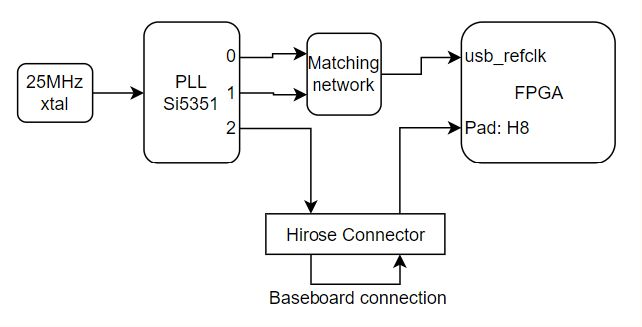

# SoM Clocks

An external Si5351A PLL is responsible for generating the USB reference clock,
as well as 2 extra clock signals out of a 25 MHz Crystal Oscillator

The Si5351 PLL can be configured over I2C.
Skyworks provides a generator tool to build the table of I2C registers address
and value for a given clock setup.

| Name                          | Frequency  | PLL pins   |
| ----------------------------- | ---------- | ---------- |
| Input crystal oscillator      | 35 MHz     | XA, XB     |
| USB REFCLK differential clock | 60 MHz     | CLK0, CLK1 |
| Free output clock             | Selectable | CLK2       |
| External input clock          | Selectable | -          |

## Hardware integration

The free output clock may be looped back to the external input clock pin, so
that the PLL provides a clock with an arbitrary frequency directly to the FPGA.

It is also possible to use the free output clock pin elsewhere on the project.

It is also possible to provide an external input clock source to the FPGA.

## RTL integration

The FPGA can use the external input clock, routed to its pin `H8`, which is
a primary clock pin (PCLK), useable for DDR I/O.

TODO: Hook an I2C core and integrate into the core SoM design

## Zephyr integration

TODO: Integrate the clock tree definition into a Device Tree.

TODO: Write a driver to initialize the PLL and control free clock signal.

## Parts used

- NDK
  [X3225GA](https://www.ndk.com/en/products/upload/lineup/pdf/NDKX03-00006_en.pdf)
  crystal unit

- Skyworks
  [Si5351A](https://www.skyworksinc.com/-/media/SkyWorks/SL/documents/public/data-sheets/Si5351-B.pdf)
  clock generator

- Texas Instrument
  [TCA9509](https://www.ti.com/lit/ds/symlink/tca9509.pdf)
  I2C level shifter

