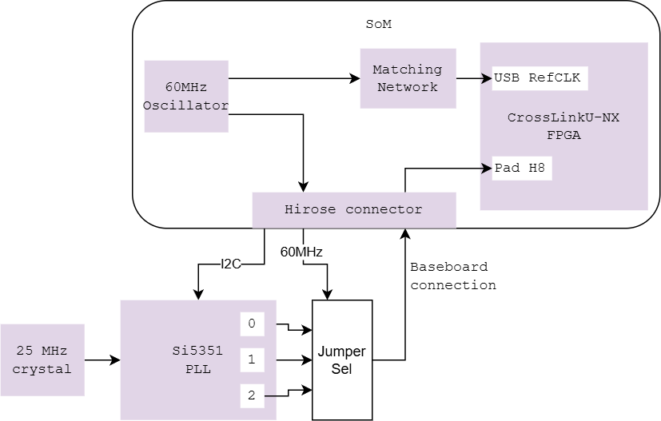
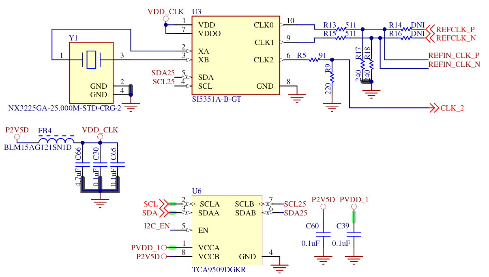

# SoM Clocks {#som_clocks}

The FPGA features one 60MHz internal oscillator that drives the USB reference clock and an internal PLL to further synthesize a clock signal out of the available sources.

An external Si5351A PLL on the devkit is responsible for generating any custom clocks.

The Si5351 PLL can be configured over I2C.
Skyworks provides a generator tool to build the table of I2C registers address
and value for a given clock setup.

| Clock                          | Frequency  | Location                 |
|--------------------------------|------------|--------------------------|
| USB REFCLK differential clock  | 60 MHz     | Internal to SoM |
| FPGA PLL External input clock       | Selectable | SoM input pin            |
| FPGA high frequency oscillator | <=450 MHz    | FPGA fabric              |
| FPGA low power oscillator      | 128 kHz    | FPGA fabric              |

## Hardware integration

The USB differential clock generation is already integrated in the SoM.
Here is the description of how it works internally.

The onboard 60MHz clock may be looped back to the external input clock pin,
so that the PLL provides a clock directly to the FPGA. If this frequency is unsuitable for the application, users can also utilize the Si5351 oscillator on the devkit to generate arbitrary frequencies.

## RTL integration

The clocks are already integrated in the RTL.

The FPGA can use the external input clock, routed to its pin `H8`, which is
a primary clock pin (PCLK).

## Zephyr integration

The timer cores are further providing Zephyr with timers, used for ensuring
a constant system tick interrupt part of RTOS scheduling.

The Si5351 PLL is not yet integrated into Zephyr as a driver. Instead, it is
called from the user code to generate the appropriate clock.

The list of registers to configure over I2C was obtained using the
[vendor tool](https://www.skyworksinc.com/Application-Pages/Clockbuilder-Pro-Software)
in the meantime.

TODO: Integrate the clock tree definition into a Device Tree.

TODO: Write a driver to initialize the PLL and control free clock signal.

## Parts featured

- NDK
  [X3225GA](https://www.ndk.com/en/products/upload/lineup/pdf/NDKX03-00006_en.pdf)
  crystal unit

- Skyworks
  [Si5351A](https://www.skyworksinc.com/-/media/SkyWorks/SL/documents/public/data-sheets/Si5351-B.pdf)
  clock generator

- Texas Instrument
  [TCA9509](https://www.ti.com/lit/ds/symlink/tca9509.pdf)
  I2C level shifter

