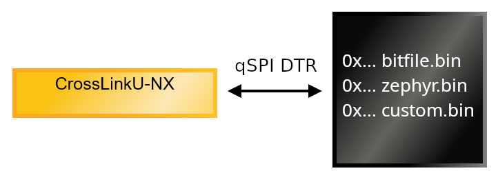
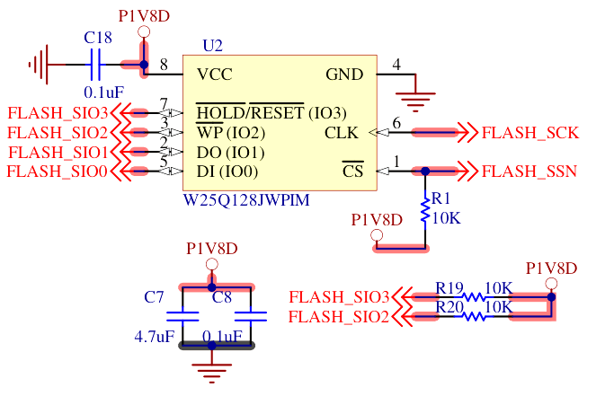

# SoM Flash

A 16 MByte (128 Mbit) QSPI flash with Dual Transmission Rate (DTR) can store the
FPGA bitfile as well as a firmware for running on the soft core.



In the default RTL, the flash is mapped at address `0x2000_0000`.

```
0x2000_0000 -- First address of FPGA bitfile
0x2010_0000 -- First address of Zephyr firmware (optional)
0x20*0_0000 -- Free area at the end of the flash for custom
```

The command [ecpprog](https://github.com/gregdavill/ecpprog) permits to send
a bitfile to the SoM by using the FTDI present on the
[BaseBoard](carrier_baseboard.md).

It can be installed as part of
[OSS Cad Suite](https://github.com/YosysHQ/oss-cad-suite-build#installation)
then called this way:

```
ecpprog -s -o 0x000000 file_to_program.bin
```

The `-o 0x000000` can be adapted to any local offset *within* the flash,
to allow multiple binary images to cohabitate.

The regular Radiant programmer can also be used as usual for Lattice parts.

## Hardware integration

The QSPI bus used by the flash can be reused for different purpose when the
flash is not used. For instance, if running the firmware without XIP.

## RTL integration

TODO: add the new QSPI DDR flash controller and map it to AXI for XIP

TODO: hook the QSPI bus as a regular SPI peripheral

## Zephyr integration

Inside the flash, the Zephyr firmware is written at offset `0x0010_0000`.

So the final start address of the Zephyr firmware is `0x2010_0000`.

This is integrated into the Zephyr DeviceTree as a flash controller entry:

```
flash0: flash@20100000 {
	reg = <0x20100000 0x100000>;
	compatible = "soc-nv-flash";
	status = "okay";
};
```

## Parts featured

- Winbond
  [W25Q128JW_DTR](https://www.winbond.com/hq/support/documentation/downloadV2022.jsp?__locale=en&xmlPath=/support/resources/.content/item/DA00-W25Q128JW_1.html&level=1)
  QSPI DTR flash


