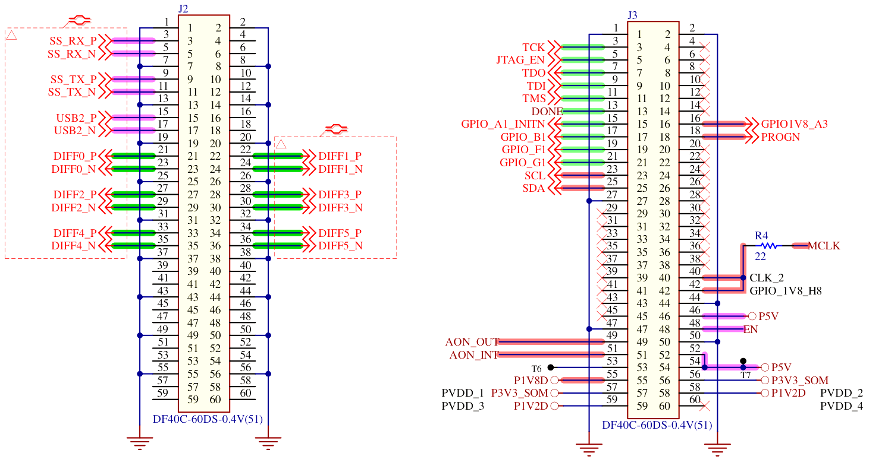

# SoM Pinout

| Left col    |VIO|VIO| Right row   | | Left col         |VIO|VIO| Right col       |
|------------:|---|---|:------------| |-----------------:|---|---|:----------------|
|     GND :01 |   |   | 02: GND     | |          GND :01 |   |   | 02: GND         |
| SS_RX_P :03 |`U`|   | 04: X       | |          TCK :03 |`1`|   | 04: X           |
| SS_RX_N :05 |`U`|   | 06: X       | |      JTAG_EN :05 |`1`|   | 06: X           |
|     GND :07 |   |   | 08: GND     | |          TDO :07 |`1`|   | 08: X           |
| SS_TX_P :09 |`U`|   | 10: X       | |          TDI :09 |`1`|   | 10: X           |
| SS_TX_N :11 |`U`|   | 12: X       | |          TMS :11 |`1`|   | 12: X           |
|     GND :13 |   |   | 14: GND     | |         DONE :13 |`1`|   | 14: X           |
|  USB2_P :15 |`U`|   | 16: X       | | GPIO_A1_INTN :15 |`1`|`0`| 16: GPIO1V8_A3  |
|  USB2_N :17 |`U`|   | 18: X       | |      GPIO_B1 :17 |`1`|`0`| 18: PROGN       |
|     GND :19 |   |   | 20: GND     | |      GPIO_F1 :19 |`1`|   | 20: X           |
| DIFF0_P :21 |`3`|`3`| 22: DIFF1_P | |      GPIO_G1 :21 |`1`|   | 22: X           |
| DIFF0_N :23 |`3`|`3`| 24: DIFF1_N | |          SDA :23 |`0`|   | 24: X           |
|     GND :25 |   |   | 26: GND     | |          SCL :25 |`0`|   | 26: X           |
| DIFF2_P :27 |`3`|`3`| 28: DIFF3_P | |          GND :27 |   |   | 28: X           |
| DIFF2_N :29 |`3`|`3`| 30: DIFF3_N | |            X :29 |   |   | 30: X           |
|     GND :31 |   |   | 32: GND     | |            X :31 |   |   | 32: X           |
| DIFF4_P :33 |`3`|`3`| 34: DIFF5_P | |            X :33 |   |   | 34: X           |
| DIFF4_N :35 |`3`|`3`| 36: DIFF5_N | |            X :35 |   |   | 36: X           |
|     GND :37 |   |   | 38: GND     | |            X :37 |   |   | 38: X           |
|       X :39 |   |   | 40: X       | |            X :39 |   |`0`| 40: CLK2        |
|       X :41 |   |   | 42: X       | |            X :41 |   |`0`| 42: GPIO_1V8_H8 |
|     GND :43 |   |   | 44: GND     | |            X :43 |   |   | 44: GND         |
|       X :45 |   |   | 46: X       | |            X :45 |   |`U`| 46: P5V         |
|       X :47 |   |   | 48: X       | |          GND :47 |   |   | 48: EN          |
|     GND :49 |   |   | 50: GND     | |      AON_OUT :49 |`0`|   | 50: GND         |
|       X :51 |   |   | 52: X       | |      AON_INT :51 |`0`|`U`| 52: P5V         |
|       X :53 |   |   | 54: X       | |           T6 :53 |   |`U`| 54: P5V         |
|     GND :55 |   |   | 56: GND     | |        P1V8D :55 |`0`|   | 56: P3V3_SOM    |
|       X :57 |   |   | 58: X       | |     P3V3_SOM :57 |   |   | 58: P1V2D       |
|       X :59 |   |   | 60: X       | |        P1V2D :59 |   |   | 60: X           |

- `U` - VBUS I/O voltage
- `0` - Bank 0 I/O voltage at 1.8 V
- `1` - Bank 1 I/O voltage between 1.2 V and 3.3 V
- `2` - Bank 2 I/O voltage between 1.2 V and 1.8 V
- `3` - Bank 3 I/O voltage between 1.2 V and 1.8 V

TODO: Document the connectivity variant

## Parts used

- Hirose [DF40C-60](https://www.hirose.com/en/product/document?clcode=&productname=&series=DF40&documenttype=Guideline&lang=en&documentid=D80_en)
  60 pin connectors (x2)

