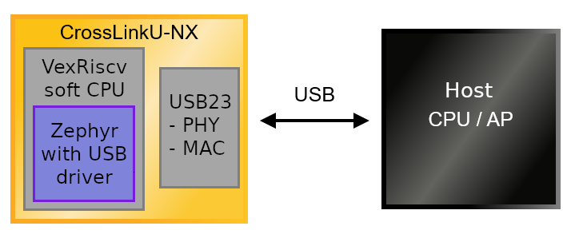

# SoM USB

The LIFCL-33U FPGA part of the CrosslinkU-NX series contains a hard USB3 core
capable of 5 Gbit/s transfers.

## Hardware integration

An external PHY is not required as the LIFCL-33U provides an integrated
USB2 and USB3 PHY.

For USB2 FullSpeed (1.5 Mbit/s) and USB2 HighSpeed (12 Mbit/s) operation,
the two USB D+/- pins can be routed to a connector,
with proper ESD protection.

For USB3 SuperSpeed (5 Gbit/s) operation, the two USB SS TX+/- and two
USB SS RX+/- pins all need to be routed to a connector,
with proper ESD protection.

In the case of Type-C, an intermediate Type-C management chip can optionally be
used to offer extended power capability of the device, but is not required if
ignoring the extra Type-C functions.

## RTL integration

A CPU core is required to manage the complexity of the hard USB core.

The data flow from the source to the USB bus is:

- The data generated by peripherals can be transferred to RAM or immediately
  available over the AXI bus.

- The VexRiscv CPU core initiates an USB transfer at USB23 core via its register
  interface and specifies the DMA transfer address.

- The USB23 performs AXI read requests to fetch the data from the specified
  address and length. For instance, 2 kBytes of LRAM, or 512 bytes directly
  from a peripheral.

The [RTL Reference Design](rtl_reference_design.md) implements this entire
system, and the data flow can be controlled by software, which covers the
enumeration and subsequent transfer of data with the USB endpoints.

TODO: Complete the integration of the new RTL VexRiscv core

## Zephyr integration

A
[Zephyr driver](https://github.com/tinyvision-ai-inc/zephyr/blob/tinyclunx33/drivers/usb/udc/udc_usb23.c)
for the Lattice USB23 core was written.

It can be selected at build-time like any other USB driver in Zephyr.

It implements the new
[Zephyr USB Device API](https://zephyrproject.org/zephyr-rtos-usb/)
known as
[`device_next`](https://docs.zephyrproject.org/latest/connectivity/usb/device_next/usb_device.html).

It complies to the Zephyr driver API, and the general documentation can be used
for configuring USB.

TODO: Send a merge request for the Zephyr driver and link it there

TODO: Provide a sample repository with a complete Zephyr firmware, along with
binaries, and publish a link here.

## Parts featured

- Lattice Semiconductor
  [LIFCL-33U](https://www.latticesemi.com/Products/FPGAandCPLD/CrossLink-NX)
  FPGA

- Lattice Semiconductor
  [USB23]()

