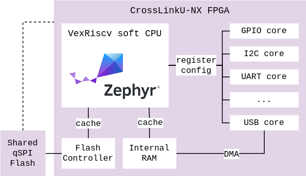

# Zephyr integration

The [Zephyr RTOS](https://docs.zephyrproject.org/) has been ported the SoM on
top of the [RTL Reference Design](rtl_reference_design.md), allowing to control
the USB core, configure the peripherals and external chis, as well as execute
custom application.

## Zephyr fork

[code](https://github.com/tinyvision-ai-inc/zephyr/tree/tinyclunx33)

An
[usb driver](https://github.com/tinyvision-ai-inc/zephyr/blob/tinyclunx33/drivers/usb/udc/udc_usb23.c)
is being implemented with the goal to be upstreamed in Zephyr.

An UVC device class is being implemented as well,
Zephyr sill missing support for it.

## Example project

[code](https://github.com/tinyvision-ai-inc/tinyclunx33_zephyr_example) -
  with build instructions. The starting point for building Zephyr for the
  tinyCLUNX33.

An example project is provided in order to:

- Test the USB device driver, with an USB CDC and soon USB UVC interface

- Communicate with an UART (baud rate 115200) through the FTDI to get
  the debug logs, or send commands to the Zephyr shell (both through the
  same UART) such as an I2C scan or raw register writes.
