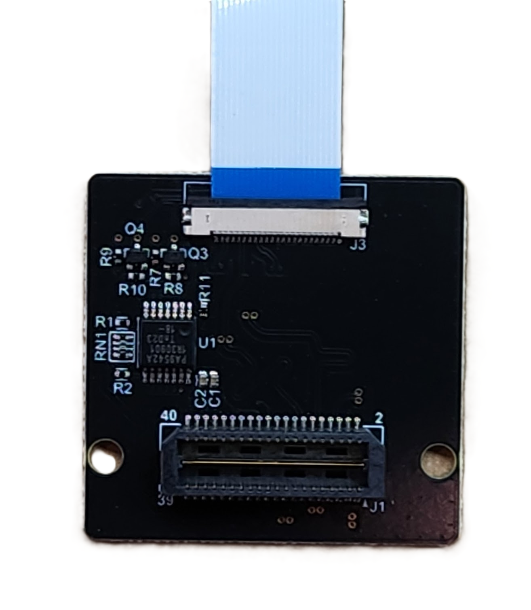

# First Light {#appnote_first_light}

This app note covers the steps to get the tinyCLUNX33 devkit running for the first time as well as debugging in case you dont get video with the devkit.

Going through each step is not mandatory but only informative, and reaching tinyVision.ai on the [chat server](https://discord.com/invite/3qbXujE) or by email is more than welcome.

## First Steps

The tinyCLUNX devkit is shipped with a pre-flashed FPGA bitfile and Zephyr image. To get started, you will need to power on the devkit by connecting the USB cable to your computer and the devkit. Before you do this however, we recommend a few applications to be installed so you can verify proper functionality and debug if needed. For details about the devkit hardware, please see the [devkit documentation](@https://tinyclunx33.tinyvision.ai/md_carrier__devkit.html).

1. Connect the MIPI cameras to the adapter board by carefully inserting the flex cable into the connector. The blue side of the flex cable should face away from the board on either side of the board. Ensure the cable is fully inserted and the connector latch is closed.
2. Check the jumpers on the devkit to ensure that the jumpers are correctly installed as shown in the picture above.
3. Connect the MIPI adapter board to the devkit by aligning the connectors and gently pressing down until fully seated.

**Note**: The devkit has 2 USBC connectors, one labelled "DEBUG" and the other labelled "DATA". The "DEBUG" connector is used to program the FPGA and is not required for the initial boot process, it also presents an additional serial port that is hooked up to the RISCV processor in the FPGA for boot as well as the Zephyr shell. 
The "USER" connector can also be used to power up the devkit and will enumerate as a Superspeed USB device.

## Windows

- [PotPlayer](https://potplayer.org/en/index.html): An excellent program that allows viewing multiple camera streams simultaneously.
- [TeraTerm](https://teratermproject.github.io/index-en.html) or any other serial terminal program: To access the Zephyr shell. The FTDI on the devkit provides a dual serial port, pick the higher port on Windows. The exact baud rate setting depends on the bitfile programmed on the devkit, please see the release notes for this information.
- [USB Tree View](https://www.uwe-sieber.de/usbtreeview_e.html): To view the USB tree and device descriptors.

1. Open the `Device Manager` by typing `devmgmt.msc` in the start menu.
2. Open the `USB Tree View` application and connect the devkit to your computer using the "DATA" connector.
3. You should see the devkit enumerated as a "tinyCLUNX33" device with one or 2 camera streams and perhaps a serial port as well.
4. If you plugged in the devkit using the "DEBUG" connector, you should see a "FTDI USB Device" entry with 2 "COM" ports. This is what you will use to program/debug the FPGA and access the Zephyr shell.
5. To view the camera stream, connect the devkit to your computer using the "DATA" connector and run PotPlayer. Open the `Open` menu and select `Device Settings` option (`Alt-D`). Select the `tinyCLUNX33` device and click on `Open Device`. You should see a video stream from the devkit.
6. If you hit the `<Tab>` key while the image stream is playing, you will see the details of the data including frame rate, size, jitter as well as a frame count. This can be quite useful to verify that the data is being received correctly.

To view the second image stream, open another instance of PotPlayer and follow the same steps as above by selecting the other tinyCLUNX33 device.

## Linux

We do not require any special software on Linux to be able to debug. The following are equivalent programs that are available on Linux:
- `ffplay`: A video player that can play multiple streams simultaneously.
- `picocom`: A terminal program that can be used to access the Zephyr shell.
- `lsusb` and `dmesg`: To view the enumeration process and device descriptors.

1. At a linux terminal, type in `sudo dmesg -w` to view the kernel messages. This will show you the enumeration process and device descriptors so you can be sure that the devkit is enumerated correctly.
2. Open up a terminal and type in `ls /dev/video*` to view the video devices. Make a note of the cameras found before the devkit was plugged in.
3. Plug in the devkit using the "DATA" connector. You should see the devkit enumerate as a "tinyCLUNX33" device with one or 2 camera streams and perhaps a serial port as well in the `dmesg` output. Type in `ls /dev/video*` again to view the video devices. You should see the devkit enumerate as a "tinyCLUNX33" device with one or 2 camera streams and perhaps a serial port as well, depending on the bitfile/zephyr image programmed on the devkit.
4. To access the Zephyr shell, connect the devkit to your computer using the "DEBUG" connector and run `picocom /dev/ttyUSB0 -b 115200` (substitute the `115200` with the baud rate specified in the release notes) in another terminal.
5. To view the camera stream, connect the devkit to your computer using the "DATA" connector and run `ffplay /dev/video1` (or whatever the new video number is) in another terminal. You should see a video stream from the devkit.
6. Repeat the `ffplay /dev/video3` step to view the other camera stream if applicable.

## No video :(

If you dont see any video on the devkit, you can try the following:

1. Check that the devkit is powered on and the `DONE` LED is lit.
2. Check the USB cable to ensure that this is a USB3 cable and not just USB2. USB3 capable cables have a blue insert in the USB connector while the USB2 cables have a black insert.
3. Check the devkit for any visible damage.
4. In case you programmed the FPGA with a different bitfile than the one that comes with the devkit, try programming the devkit with the default bitfile/Zephyr that is part of a release and check if there is data coming on the FTDI serial port. This indicates that the bitfile isnt corrupted and that the RISCV in the FPGA is properly booting.
5. For a deeper level of debug, please see the [debugging USB video](appnote_debugging_usb_video.md) app note.
6. If the problem persists, please reach out to tinyVision.ai on the [chat server](https://discord.com/invite/3qbXujE) or by email (support@tinyvision.ai).

