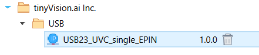

# MIPI to UVC Core Datasheet and Application notes {#appnote_mipi_to_uvc_core}

This app note presents the details of the tinyVision.ai MIPI2UVC core. This core is designed for the Lattice Semiconductor CrosslinkU-NX33 FPGA only. There are 2 package options available for the FPGA and this core is compatible with both options.

## Overview

The `Stream2UVC` IP is an IP core that facilitates the transfer of video data from an FPGA to a host system via USB, presenting the data as a USB Video Class (UVC) stream. This module provides multiple independent video streams and interfaces with various subsystems including USB, Wishbone for configuration and control, interrupt outputs, and AXI Stream interfaces for data transmission.

## Functional Description

The core accepts video data through one or more independent AXI Stream interfaces and converts them into UVC-compliant USB packets utilizing the Lattice Semiconductor Hard USB core.

The core is designed such that data pushed into the internal FIFOs appears at the host as a UVC stream with minimal delays. While we talk about this as a MIPI2UVC core, the design is a general purpose data mover engine that transports bits from a 64 bit FIFO in the FPGA to the host.

The core includes:

- Multiple independent video stream processing
- USB 2.0/3.0 physical layer interface
- Wishbone configuration and control interface
- Interrupt generation for system events
- Integration with Zephyr RTOS drivers

**NOTE:** An external processor is required to handle the complex USB enumeration process and negotiation during UVC initiation. The actual data never touches the processor itself and flows directly from the input FIFO's to the USB hard IP in the FPGA. As a result, the processor is idle after the USB negotiations are complete and fully available to the user.

## Sample Use Cases

The core can be used for briding USB to almost any image sensor. We have seen applications including:
- Single/multiple high resolution image sensors for robotics, drones and hyper-spectral imaging
- Line scan sensors for medical imaging
- Multiple synchronized low resolution sensors for applications such as navigation and tracking in robotics, smart glasses
- Multiple types of sensors (RGB + Mono/ToF/Thermal) for sensor fusion
- Sensor heads for dental imaging, portable ultrasound, robotics
- Low resolution cameras + Displays for IoT products

## Interface Signals

### Clock and Reset

| Signal | Direction | Width | Description |
|--------|-----------|-------|-------------|
| `clk` | Input | 1 | System clock signal, recommend a minimum processor clock of 80MHz to meet USB latency limits during enumeration. |
| `reset` | Input | 1 | System reset signal (active high, sync'ed to `clk`) |
| `usb_clk` | Input | 1 | USB clock signal, 60MHz, can be derived from IO or a PLL output |
| `usb_reset` | Input | 1 | USB reset signal (active high, sync'ed to `usb_clk`) |

There is no sequencing requirement between the two resets.

### Wishbone Configuration Interface

The core provides multiple Wishbone interfaces for configuration and control:

#### CSR Wishbone Slave Interface (Primary control/configuration)

The core requires configuration and control to function properly. The core consumes a 28-bit address space and is designed to map into the `0xb000_0000 to 0xbfff_fffc` space in a processor. Note that we do not implement byte level access to registers within the USB core and all registers are assumed to be accessed as 32 bit data words. An implication is that the lower 2 bits of the Wishbone are not used.

| Signal | Direction | Width | Description |
|--------|-----------|-------|-------------|
| `wb_m2s_wb0_cyc` | Input | 1 | Cycle signal for CSR Wishbone master |
| `wb_m2s_wb0_stb` | Input | 1 | Strobe signal for CSR Wishbone master |
| `wb_m2s_wb0_we`  | Input | 1 | Write enable signal for CSR Wishbone master |
| `wb_m2s_wb0_adr` | Input | 32 | Address bus for CSR Wishbone master |
| `wb_m2s_wb0_dat` | Input | 32 | Data bus for CSR Wishbone master |
| `wb_m2s_wb0_sel` | Input | 4 | Byte select signals for CSR Wishbone master |
| `wb_s2m_wb0_ack` | Output | 1 | Acknowledge signal from CSR Wishbone slave |
| `wb_s2m_wb0_dat` | Output | 32 | Data bus from CSR Wishbone slave |

#### CSR Wishbone Master Interface (Stream related)

Each stream core also provides a subset of the Wishbone address space which can be used to map registers from the user logic that is related to the stream. Typical example of such usage is the ISP associated with the particular streeam. This mapping makes the driver development modular especially when the different streams are similar in their characteristics eg. multiple RGB cameras.

| Signal | Direction | Width | Description |
|--------|-----------|-------|-------------|
| `wb_m2s_csr[0,1]_cyc` | Output | 1 | Cycle signal for secondary CSR Wishbone master |
| `wb_m2s_csr[0,1]_stb` | Output | 1 | Strobe signal for secondary CSR Wishbone master |
| `wb_m2s_csr[0,1]_we`  | Output | 1 | Write enable signal for secondary CSR Wishbone master |
| `wb_m2s_csr[0,1]_adr` | Output | 32 | Address bus for secondary CSR Wishbone master |
| `wb_m2s_csr[0,1]_dat` | Output | 32 | Data bus for secondary CSR Wishbone master |
| `wb_m2s_csr[0,1]_sel` | Output | 4 | Byte select signals for secondary CSR Wishbone master |
| `wb_s2m_csr[0,1]_ack` | Input  | 1 | Acknowledge signal from secondary CSR Wishbone slave |
| `wb_s2m_csr[0,1]_dat` | Input  | 32 | Data bus from secondary CSR Wishbone slave |

### AXI Stream Data Interfaces

The core provides multiple independent AXI Stream interfaces for video data input. Each interface follows the standard AXI stream protocol.

#### Stream Interface
| Signal | Direction | Width | Description |
|--------|-----------|-------|-------------|
| `streamIns_0_valid` | Input | 1 | Valid signal for AXI Stream input 0 |
| `streamIns_0_ready` | Output | 1 | Ready signal for AXI Stream input 0 |
| `streamIns_0_last` | Input | 1 | Last signal for AXI Stream input 0 (end of frame) |
| `streamIns_0_data` | Input | 64 | Data bus for AXI Stream input 0 |
| `numBytes_0` | Output | 24 | Number of bytes processed in stream 0 |

### USB Physical Interface

The core requires a set of pins to be connected directly to the FPGA IO. Please place these pins on the right pads for the FPGA. Not doing this correctly will cause Map errors. Please refer to the provided pin constraints file for a sample configuration that works.

| Signal | Direction | Width | Description |
|--------|-----------|-------|-------------|
| `usbIO_VBUS` | Inout | 1 | USB VBUS line (power detection) |
| `usbIO_REFINCLKEXTP` | Input | 1 | USB reference clock input (60MHz) |
| `usbIO_REFINCLKEXTM` | Input | 1 | USB reference clock input () |
| `usbIO_RESEXTUSB2` | Inout | 1 | USB external reset line |
| `usbIO_DP` | Inout | 1 | USB 2 data plus line (D+) |
| `usbIO_DM` | Inout | 1 | USB 2 data minus line (D-) |
| `usbIO_RXM` | Input | 1 | USB 3 receive minus line (USB 3.0) |
| `usbIO_RXP` | Input | 1 | USB 3 receive plus line (USB 3.0) |
| `usbIO_TXM` | Output | 1 | USB 3 transmit minus line (USB 3.0) |
| `usbIO_TXP` | Output | 1 | USB 3 transmit plus line (USB 3.0) |

### Interrupt Outputs

The interrupt outputs from the core should be connected to the interrupt controller of the SoC. Interrupts are active high, level sensitive and held high until the interrupt source is cleared by the processor.

| Signal | Direction | Width | Description |
|--------|-----------|-------|-------------|
| `irq` | Output | 1 | Interrupt from the RTL sorrounding the USB hard IP|
| `usb23_irq` | Output | 1 | USB hard IP interrupt output |

## Integration Guidelines

### Zephyr RTOS Integration

The Wishbone interface is designed to be connected to a processor hosting Zephyr RTOS with a dedicated driver for the RTL. The driver provides:

- Configuration/Control register access
- USB enumeration and UVC descriptor management
- Stream control and status monitoring
- Interrupt handling

Please refer to the the [Zephyr application note](appnote_zephyr_sdk.md) for more details.

### System Integration

#### FAQ's

1. **Clock Domain Crossing**: The core operates in multiple clock domains (system clock, USB clock)
2. **Reset Synchronization**: Ensure resets are externally synchronized to the respective clock domain
3. **Stream Management**: Each stream operates independently with its own FIFO and control logic. There is no dependency between multiple streams.
4. **Timing**: The core has been designed with a maximum of 100MHz `clk`.
5. **Unused ports**: You can use a dual stream IP with a single stream by tying off the unused ports to idle values (`valid`, `data`, `last` are set to `0` and `ready` is left open). Wishbone ports shall have `ack`, `data` set low. This allows synthesis to optimize away most of the unused logic. For even smaller designs, you can use the single stream version of the core.
6. **Delays and buffers**: The core itself implements a minimal amount of bufferring required to feed the USB hard IP in the FPGA. As a result, latency and jitter are limited by the USB protocol for the most part.

#### Installing the IP

1. Open the Radiant tool and load your project.
2. Click on the `IP Catalog`, then the `Install a User IP` icon. 
3. Follow the prompts to select the IPK file and install the IP into the local Radiant cache.
4. Navigate to the `.ipk` file and create a new instance of the IP.
5. This IP should now be available to you in the IP Catalog.

6. Double click on the newly installed IP and fill out the query form to create your own instance of the IP: 

**NOTE**: You can select either the single stream or dual stream IP when you customize the IP. Please note that the generated IP consumes the only instance of Hard USB IP in the FPGA so you cannot instantiate more than one core per FPGA.

#### Licensing the core

- **Evaluation**: The core is available for evaluation via a time limited evaluation (approx. 4 hours running time). Please contact `sales@tinyvision.ai` for more details.
- **Production**: A paid license is required to use the core in a customer product. Please contact `sales@tinyvision.ai` for more details.

#### Utilization

The following table shows the area of the USB IP core for different configurations (Map resource usage).

| Configuration       | PFU Registers | EBRs | LRAM |
|---------------------|---------------|------|------|
| UVC, single Stream  | 2244          | 11   | 2    |
| UVC, dual Stream    | 3753          | 13   | 2    |

#### Power Consumption

The FPGA with sorrounding power and clock circuitry has been measured to consume approximately 200mW at 5V while transferring 3.4Gbps over the USB3 link. Power does drop significantly at lower bandwidths.

Please contact tinyVision.ai if power is critical to your application.

#### Memory Maps

The MIPI2UVC core provides several memory-mapped regions accessible through the Wishbone interfaces. The specifics of these interfaces such as registers are black-boxed and exposed via the Zephyr driver that is also available.

| Region | Base Address | Mask | Size | Access | Description |
|--------|--------------|------|------|--------|-------------|
| **USB Core** | `0xb0000000` | `0xff000000` | 16MB | CPU, USB | USB hard IP core configuration and control registers |
| **AXI RAM** | `0xb1000000` | `0xff000000` | 16MB | CPU, Data | Memory-mapped interface to the AXI shared RAM |
| **CSR: First stream** | `0xb2000000` | `0xfff00000` | 1MB | CPU | Control and Status Registers for primary stream |
| **CSR: Second stream** | `0xb2100000` | `0xfff00000` | 1MB | CPU | Control and Status Registers for secondary stream |
| **USB Manager: First stream** | `0xb4000000` | `0xfffffc00` | 1KB | CPU, Regs | USB manager configuration registers |
| **USB Manager Regs: Second stream** | `0xb4000400` | `0xfffffc00` | 1KB | CPU, Regs | USB manager configuration registers |
| **Data Mover Core** | `0xb4009000` | `0xfffffc00` | 1KB | CPU | Data mover control registers |
| **IRQ** | `0xbf000000` | `0xfffffc00` | 1KB | CPU | Interrupt controller registers |

**Notes:**
- All regions support 32-bit word access only (byte-level access not implemented)
- Lower 2 bits of Wishbone address are ignored
- You must use the `nocache` attribute for these memory regions to avoid the common mistake of caching data meant for IO
- CSR regions provide stream-specific configuration and status
- USB Manager regions handle USB enumeration and UVC descriptor management
- The `wb_csr` block provides an `LMMI` interface to communicate with various Lattice cores such as the MIPI Rx DPHY. This is mapped in the `wb_csr` block at an offset of `0x400`. For example, the CSI block for stream 0 will be mapped at registers starting at `0xb200_0400`.

#### Performance Considerations

- Maximum throughput depends on USB speed (USB 2.0/3.0) as well as host side USB hardware and stack.
- The USB3 Stream bandwidth is shared between the video streams. Aim for a maximum of 3.4Gbps of data between all streams as a peak number.
- FIFO depth affects latency and throughput characteristics.

#### Standards and Compliance

- **USB3 Certification**: The FPGA itself has passed USB3 certification testing. Please contact Lattice Semiconductor sales for more details. The certification requires a USB redriver for the Tx for passing the long cable test but otherwise does not require a re-driver.
- **UVC Compliance**: We run through the UVC compliance suite of tests to maximize compliance with the UVC 1.5 specification. 

#### Code Samples

The private repository of code that contains the `IPK` also contains detailed implementations of the core for a single and dual stream 1920 x 1080 x 30fps camera stream using the IMX219 sensors. Please refer to the sample code for details.

RTL examples feature:
- RISCV core + MIPI2UVC core for single and dual streams
- MIPI CSI integration for multiple MIPI Rx cores
- ISP including debayer, RGB2YUV, YUV to 422
- Wishbone CSR for collecting statistics and controlling the ISP
- I2C to control sensors

#### Debugging tips

Please refer to [this page](https://tinyclunx33.tinyvision.ai/appnote_debugging_usb_video.html ) for tips on debugging common issues with Video.

## Core Revision History

| Version | Description |
|---------|-------------|
| 1.0.0 | Initial release, no JTAG debug |
| 1.0.1 | Fixed multiple bugs, added formal verification |
| 1.0.2 | Fixed LRAM bug and using LRAM to reduce the number of EBRs |
| 1.0.3 | Fixed issues with stream instability |
| 1.0.4 | Major rewrite of the internals of the USB IP core to address instability issues |

## References

### Technical Standards and Documentation

- **Wishbone Bus Specification**: [Wishbone B4 Specification](https://cdn.opencores.org/downloads/wbspec_b4.pdf) - OpenCores Foundation
- **ARM AMBA Specifications**: [ARM AMBA Documentation](https://developer.arm.com/documentation/ihi0024/latest/) - ARM Limited
- **USB Video Class Specification**: [UVC 1.5 Specification](https://www.usb.org/sites/default/files/documents/uvc_1_5_20121220.zip) - USB Implementers Forum
- **USB3CV Compliance Test Suite**: [USB-IF Compliance Tools](https://www.usb.org/document-library/usb3cv) - USB Implementers Forum
- **AXI4-Stream Protocol**: [AMBA 4 AXI4-Stream Protocol Specification](https://developer.arm.com/documentation/ihi0051/latest/) - ARM Limited
- **Zephyr UVC Video**: [The Zephyr video page](https://docs.zephyrproject.org/latest/samples/subsys/usb/uvc/README.html) - Linux Foundation

### Related Documentation

- **Zephyr RTOS**: [Zephyr Project Documentation](https://docs.zephyrproject.org/) - Linux Foundation
- **FPGA Integration Guidelines**: See [RTL Reference Design](rtl_reference_design.md) for FPGA-specific integration details
