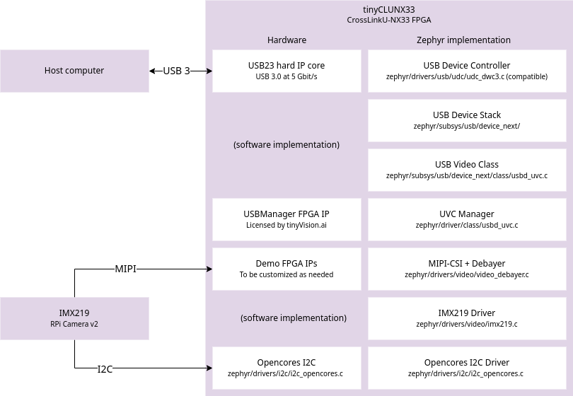

# Zephyr Video Pipeline {#appnote_zephyr_video_pipeline}

This app note describes the video pipeline firmware-side configuration of the tinyCLUNX33.
This covers the full configuration possibilities from RTL custom registers.


## General overview



The tinyCLUNX33 is an [FPGA](https://en.wikipedia.org/wiki/Fpga) module, where the VexRiscv CPU
architecture is loaded from [flash](som_flash.md) at runtime, in addition to the peripherals
already provided by the FPGA fabric. Those are shown on the left of the diagram above.

On top of this, also from flash, the firmware is executed, with the Zephyr RTOS and drivers for
each hardware elements. Those are shown on the right on the diagram above.

This shows the path of the data on each hardware element (left side, for I/O), and the software
elements (right side, for control).


## Video elements

* **USB23 Hard IP:** The CrossLinkU-NX33 comes with a hardware USB 3 MAC that can be pushed
  up to 3.4 Gbit/s at the application layer.

* **USB Device Controller:** The Zephyr-side driver for the USB23 IP. The hardware API is for the
  most part compatible with DWC3 register interface, inspired from the standard XHCI, but for
  device-side rather than host-side.

* **USB Device Stack:** The core implementation of USB is provided by Zephyr, and maintained by its
  contributors. It is not involved in the data path of USB in the case of the tinyCLUNX33, which
  allows to reach higher speeds than what software handling allows. However, all the enumeration
  process and the control comands are handled with software by this USB stack.

* **USB Video Class:** The handling of the UVC protocol, aka the "webcam protocol", with all the
  control commands interfaced to video API calls, further turned into I2C calls by the video driver.

* **USB Manager FPGA IP:** The FPGA core that handles the high-speed data transfer over USB,
  directly at the hardware level, without involving the CPU, directly from the video source to the
  USB endpoint.

* **UVC Manager Driver:** The Zephyr-side implementation, that configures the USB Manager FPGA IP at
  boot-time.

* **Demo FPGA IPs:** FPGA-side implementation of a basic image pipeline, including MIPI and debayer
  allowing to get an image out without correction. This is the element that a custom solution would
  modify to fit a particular input sensor, or several of them.

* **MIPI-CSI + Debayer:** The Zephyr-side driver for the **Demo FPGA IPs** that might be modified as
  well along with the FPGA side.

* **IMX219 Driver:** The Zephyr-side implementation of the IMX219 image sensor driver, sending
  commands over I2C according the the Video API. It receives the Video API calls from the UVC
  driver. This driver can be swapped with any other image sensor driver.

* **Opencores I2C:** An I2C controller that permits to communicate with the image sensor(s) and
  other I2C peripherals.

* **Opencores I2C Driver:** The Zephyr-side implementation of the I2C peripheral.


## Pipeline driver setup

Like any Zephyr video driver, this video pipeline is using the
[devicetree](https://docs.zephyrproject.org/latest/build/dts/index.html)
to interconnect the drivers together. The syntax used is inherited from Linux taken as inspiration:

```
video0: video@12300000 {
	compatible = "example,video-source";
	port {
		video0_ep_out: endpoint {
			remote-endpoint-label = "video1_ep_in";
		};
	};
};

video1: video@12400000 {
	compatible = "example,video-sink";
	port {
		video1_ep_in: endpoint {
			remote-endpoint-label = "video0_ep_out";
		};
	};
};
```

This shows an interconnection between two video processing elements: a source `video0` upstream
sending data to a `video1` downstream.

The `port` and `endpoint` represent the input or output connection with the other video processing
element, and the `remote-endpoint-label` specifies the name of the other endpoint with which the
current endpoint is connected.

This forms a bidirectional reference between the two video elements that is used by the drivers to
know what is the next and previous driver in the chain.

In order to facilitate the configuration, the tinyCLUNX33 video elements are already pre-integrated
as seen
[here](https://github.com/tinyvision-ai-inc/priv-tvai-usb/tree/main/zephyr/dts/riscv/tinyvision),
and turned off by default.

This permits to keep the applications compact, which only need to turn on the drivers they use, as
seen
[here](https://github.com/tinyvision-ai-inc/priv-tvai-usb/blob/main/firmware/zephyr_imx219/app.overlay).

The syntax to enable a core in Zephyr is:

```
&video0 {
	status = "okay";
};
```

The `&` of `&video0` is there to refer to an existing node defined elsewhere.

Other driver parameters can be described as well in addition to `status`, for instance to change the
default values provided by the global configuration.

See the [Zephyr configuration](appnote_zephyr_configuration.md) for a detailed review of these
configuration files.
