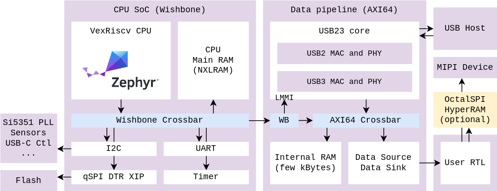

# RTL Reference Design

The RTL Reference Design is a set of Verilog sources (sometimes generated from
another HDL) providing common design elements for building an application on
top of the SoM hardware.

Once completed, it will usable as a stand-alone design for implementing a
product, or as a base to build upon.

To build this component, refer to the
[RTL build instructions](https://github.com/tinyvision-ai-inc/tinyclunx33/blob/main/rtl/README.md).

For RTL engineers, the Reference Design is presented as a single module
providing a data communication interface for the feed that goes through USB.

TODO: present example Verilog instantiation illustrating this

The RTL reference design is made out of two independent parts (Data Pipeline,
CPU SoC), and an interface for inserting custom data processing at ease:

## Data Pipeline (AXI64)

The user does not need to customize this part, although it is possible.

External ports:

- **Wishbone port** for a CPU to access the internal AXI64 crossbar.

- **AXI64 port** for connecting custom RTL producing/consuming the USB data,
  integrated as an AXI slave, with FIFO/Stream adapters available.

Internal AXI64 cores:

- **USB23 bus master** performing AXI bus requests for transferring data to the
  USB host, from the address indicated by the CPU.

- **Small block of RAM** for the CPU to store small buffers for use by the
  USB23 core.

## CPU SoC (Wishbone)

The user does not need to customize this part, although it is possible.

External ports:

- **Wishbone port** so that the CPU can control an external bus, for use with
  the Data Pipeline's Wishbone port seen above.

- **Hardware interfaces** such as I2C, UART, qSPI, GPIO.

Internal Wishbone cores:

- **[VexRiscv](https://github.com/SpinalHDL/VexRiscv)** CPU, controlling the
  peripherals, configuring their configuration registers over Wishbone.

- **Main CPU RAM** controller, memory-mapped to the Wishbone bus for use by the CPU and its firmware.

- **qSPI DTR Flash** controller, memory-mapped to the wishbone bus so that the CPU
  can execute its firmware from flash (XIP). See [SoC Flash](som_flash.md).

- **Timer** controller, used as systick by the Zephyr RTOS.

- **I2C** controller, used to program the external [Si5351 PLL](som_clocks.md),
  MIPI image sensors, USB-C port controller, or anything else connected to I2C.

- **UART** controller, used for printing debug logs or configuration shell.

- **Extra peripherals** can be integrated to support external SoCs.

## User RTL

The interface for moving large amounts of data from custom RTL to the USB core
is a standard AXI64 slave.
Specific configuration and addresses for AXI access are controlled by the corresponding USB endpoint configuration in the Zephyr driver.

Helper cores available MIPI/USB/RAM:

- **Wrappers around the AXI64 port** offering a FIFO or Stream based interface
  rather than an AXI one.

- **[OctalSPI and HyperRAM](som_memory.md)** controllers for facilitating the access to this
  external chip on the *Compute* variant.

- TODO: pixel, MIPI and image data processing utilities.

## Troubleshooting

### The DONE LED is not being lit

If the FPGA bitfile gets loaded successfully and is being enabled in the FPGA,
then the DONE LED will be lit-up.

If it is not lit, you probably did not program the FPGA properly.
Please program the FPGA using the [instructions provided](som_flash.md).

- A **valid** FPGA image that was **incorrectly** programmed would lead to the
  DONE LED staying off.

- An **invalid** FPGA image that was **correctly** programmed would lead to the
  DONE LED staying off.

- A **valid** FPGA image that was **correctly** programmed but with a bug
  inside the RTL is still expected to have the DONE LED lit-up

### The DONE LED is lit but the RTL Reference Design does not work

Make sure to also load a
[Zephyr Example Release](https://github.com/tinyvision-ai-inc/tinyclunx33/releases/)
matchiing the RTL Reference Design version you programmed.

Check also the [flash offset at which you program things](som_flash.md).

Make sure to power cycle the board right after programming it.

The RTL Reference Design uses a flash in qSPI mode.
For this to work, a special Quad Enable (QE) bit needs to be set in the flash
via SPI commands, i.e. done by the FTDI.

Once this is active, this stays in the flash until it is changed.
This is usually done by tinytVision.ai at the factory.

If you are an early user, you might require to do this yourself.

This can be done, for instance, with the Radiant Programmer software part
of the Radiant package, instead of using `ecpprog`.

The [flash documentation](som_flash.md) explains how to use the
Radiant Programmer to do it.

### The DONE LED is lit but my custom RTL Design does not work

There are many possibilites! Here are a few:

- Have you simulated your design successfully?
  If not, you go to Jail: miss a turn, go back to start, pay a penalty, simulate and come back here.

- Have you provided the right pin constraints?
  Incorrect pin constraints can cause the board to lock up (but not brick!).

- Are your clocks properly constrained?

- Do you have any timing violations?
  If so, resolve them.

### Q: Is there a requirement to be on Windows, or can I use the Radiant tool with Mac OS or Linux?

You can use Linux, Radiant has a Linux installation available.

Lattice Radiant does not currently support Mac OS.
It is possible to use a Windows or Linux virtual machine and run Radiant inside.

### Q: Can the FPGA be programmed with the free licence version of the tool, or do I need the paid one?

RISCV firmware and FPGA bitfiles can be programmed using either Radiant or
[`ecpprog`](https://github.com/gregdavill/ecpprog)
which is included with the
[OSS CAD Suite](https://github.com/YosysHQ/oss-cad-suite-build)
toolchain.

For any changes to the FPGA or to recompile the FPGA or to use it for debug, you will need the Radiant tool license which is free and available from the
[Lattice website](https://www.latticesemi.com/Support/Licensing#requestRadiant).

Note that you may require additional licenses to complete your work.
For example, MIPI related components, which you can request from Lattice.

For more details on how to flash the firmware, please refer to [SoM Flash](som_flash.md).
