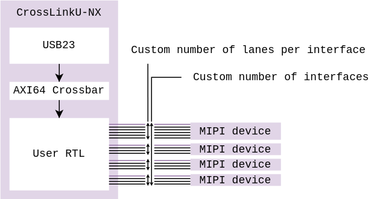

# SoM MIPI {#som_mipi}

The differential pairs of the CrossLinkU-NX FPGA can be combined together into
MIPI interfaces. These MIPI image signals can further be processed by the FPGA
and be transferred through to USB 5 Gbit/s or another interface of any kind.

On the Compute SoM variant, some differential pairs are used for the external
RAM, absent from the Connectivity SoM variant, leading to 6 or 14 differential
pairs available.

## Hardware integration

The MIPI pins are capable of 1.2 Gbit/s I/O in differential mode.

Each MIPI interface can have more or less differential pairs for the data lanes,
and always one dedicated pair for the associated clock signal.

**Connectivity SoM** Lanes and Clocks (14 pairs available):

| 1L + 1C | 2L + 1C | 4L + 1C | Total |
|:-------:|:-------:|:-------:|:-----:|
|         | 1x      | 2x      | 13    |
| 2x      |         | 2x      | 14    |
|         | 3x      | 1x      | 14    |
| 4x      |         | 1x      | 13    |
| 1x      | 2x      | 1x      | 13    |
| 1x      | 4x      |         | 14    |
| 7x      |         |         | 14    |

**Compute SoM** Lanes and Clocks (6 pairs available, others used by the RAM):

| 1L + 1C | 2L + 1C | 4L + 1C | Total |
|:-------:|:-------:|:-------:|:-----:|
|         |         | 1x      | 5     |
|         | 2x      |         | 6     |
| 1x      | 1x      |         | 5     |
| 3x      |         |         | 6     |

## RTL integration

TODO: describe the FIFO interfaces available to feed the data from MIPI into USB

TODO: describe the MIPI data pipeline once released.

## Zephyr integration

TODO: evoke the UVC configuration possible/required to do once UVC is there

## Parts featured

- Lattice Semiconductor
  [LIFCL-33U-8CTG104CAS](https://www.latticesemi.com/Products/FPGAandCPLD/CrossLink-NX)
  FPGA (search for 33U in this page).

