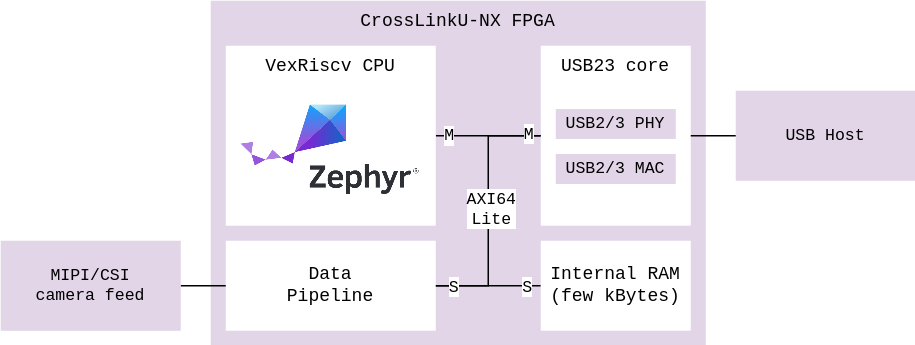

# SoM USB {#som_usb}

The LIFCL-33U FPGA part of the CrosslinkU-NX series contains a hard USB3 core
capable of 5 Gbit/s transfers.


## Hardware integration

An external PHY is not required as the LIFCL-33U provides an integrated
USB2 and USB3 PHY.

For USB2 FullSpeed (12 Mbit/s) and USB2 HighSpeed (480 Mbit/s) operation,
the two USB D+/- pins can be routed to a connector,
with proper ESD protection.

For USB3 SuperSpeed (5 Gbit/s) operation, the two USB SS TX+/- and two
USB SS RX+/- pins all need to be routed to a connector,
with proper ESD protection.

In the case of Type-C, an intermediate Type-C management chip can optionally be
used to offer extended power capability of the device, but is not required if
ignoring the extra Type-C functions.


## RTL integration

A CPU core is preferred to manage the Lattice USB23 register interfae.



The data flow from the source to the USB bus is:

- The data generated by peripherals can be transferred to RAM or immediately
  available over the AXI bus.

- The VexRiscv CPU core initiates an USB transfer at USB23 core via its register
  interface and specifies the DMA transfer address.

- The USB23 performs AXI read requests to fetch the data from the specified
  address and length. For instance, 2 kBytes of LRAM, or 512 bytes directly
  from a peripheral.

**USB webcam: USB23 directly reading from the camera ImageSensor:**
```
VexRiscvCPU     ImageSensor     InternalRAM     USB23Core       Host
(AXI Master)    (AXI Slave)     (AXI Slave)     (AXI Master)     │
 │               │               │               │               │
 │───read─request─ImageSensor───────────────────>│               │
 │               │<───────────────────AXI─read───│               │
 │               │───AXI─data───────────────────>│               │
 │               │               │               │──USB─data────>│
 │               │               │               │               │
```

**USB serial: USB23 reading from internal memory:**
```
VexRiscvCPU     ImageSensor     InternalRAM     USB23Core       Host
(AXI Master)    (AXI Slave)     (AXI Slave)     (AXI Master)     │
 │               │               │               │               │
 │───AXI─write──────────────────>│               │               │
 │───read─request─InternalRAM───────────────────>│               │
 │               │               │<───AXI─read───│               │
 │               │               │───AXI─data───>│               │
 │               │               │               │──USB─data────>│
 │               │               │               │               │
```

The [RTL Reference Design](rtl_reference_design.md) implements this entire
system, and the data flow can be controlled by software, which covers the
enumeration and subsequent transfer of data with the USB endpoints.

- A small local memory provides fast transfer for USB Transfer Requests (TRB's),
  part of the DMA mechanism: data can be stored by the CPU and retrieved by the
  USB23 core.

- USB transactions (enumeration, CDC, other low bandwidth tasks) can also use as
  a local scratch space where endpoint data is located.

- For any higher bandwidth transfer, a full AXI64 slave is utilized that allows
  for fast transfer at high bandwidth required to keep the USB pipe running
  without being throttled.


## Zephyr integration

A
[Zephyr driver](https://github.com/tinyvision-ai-inc/tinyclunx33/blob/main/zephyr/drivers/usb/udc/udc_dwc3.c)
(private repository for now) for the Lattice USB23 core was written, which is comparable in hardware
interface with the Synopsys DWC3 core, which is used as specification the driver.

It can be selected at build-time like any other USB driver in Zephyr.

It implements the new
[Zephyr USB Device API](https://zephyrproject.org/zephyr-rtos-usb/)
known as
[`device_next`](https://docs.zephyrproject.org/latest/connectivity/usb/device_next/usb_device.html).

It complies to the Zephyr driver API, and the general documentation can be used
for configuring USB.

TODO: Send a merge request for the Zephyr driver and link it there

An example Zephyr firmware with the USB core enabled is provided as example:
[`zepyr_cdc_raw`](https://github.com/tinyvision-ai-inc/tinyclunx33/tree/main/firmware/zephyr_cdc_raw).


## Parts featured

- Lattice Semiconductor
  [LIFCL-33U](https://www.latticesemi.com/Products/FPGAandCPLD/CrossLink-NX)
  FPGA

- Lattice Semiconductor
  [USB23](https://www.latticesemi.com/products/designsoftwareandip/intellectualproperty/ipcore/ipcores05/usb-2_0-3_2-ip-core)
  Physical core for USB2 and USB3 at 5 Gbit/s


